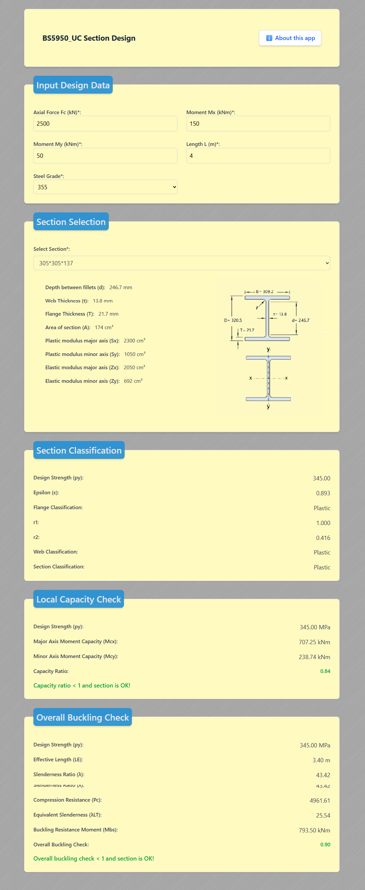

# BS5950_UC Section Design                                   [🔗UC](https://3axis.se/mina/uc/)

This is a web-based application built using **React + Vite** that allows engineers to perform structural capacity checks for **Universal Column (UC)** steel sections in accordance with the **British Standard BS 5950**.

---

## 📸 Screenshot



---

## 🔍 Purpose

This tool helps assess structural UC members for:

- **Section classification** (Plastic, Compact, Semi-Compact, Slender)
- **Local cross-section capacity**
- **Overall buckling capacity check**

---

## 📐 Design Code References

Calculations are based on:

- **BS 5950-1:2000**  
  - **Clause 4.7.7**: Columns in simple structures  
  - **Clause 4.8.3.2**: Cross-section capacity for compression members with moments

---

## ⚠️ Limitations

> **Important:**  
> This application does **not** handle members classified as **Slender**.  
> If a slender section is detected, the tool will notify the user.  
> For accurate analysis of slender members, please use a more advanced structural design tool that considers **local buckling** and **second-order effects**.

---

## 📣 Disclaimer
This application is designed for preliminary design and educational use only.
It does not replace a full structural analysis using licensed engineering software.
All results should be verified by a qualified structural engineer before implementation in real-world projects.

---

## 🚀 Tech Stack

- **React**
- **Vite**
- **Tailwind CSS**
- **JavaScript (ES6+)**

---

## 📄 License

This project is open-source and available under the [MIT License](LICENSE).

---

## 📦 Installation

```bash
# Clone the repository
git clone https://github.com/your-username/uc-section-calculator.git
cd uc-section-calculator

# Install dependencies
npm install

# Run the development server
npm run dev

---
